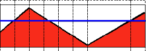

# 传统常用图像处理综述

## 前言

虽然目前基于深度学习的图像处理已经吸引了图像处理领域的绝大数目光，有很多CV领域新的从业者都是被ImageNet上优秀的Top-1 准确率吸引从而踏入了这个领域，但传统图像处理技术是基础，绝大部分情况下都是需要这些基本操作的，而对于具体的实际问题，其实就是一个解决方案的设计问题了，有些场景下传统图像处理有它的优势所在，无论是现在还是以后，传统图像处理的技术都是需要的，即使是目前基于深度学习的计算机视觉算法，其很多内在的思想都是来源于传统图像处理技术。

## 认识图像

从真实世界中获取数字图像有很多方法，比如数码相机、扫描仪、CT或者磁共振成像。无论哪种方法，我们（人类）看到的是图像，而让数字设备来“看“的时候，则是在记录图像中的每一个点的数值。


比如上面的图像，在标出的镜子区域中你见到的只是一个矩阵，该矩阵包含了所有像素点的强度值。如何获取并存储这些像素值由我们的需求而定，最终在计算机世界里所有图像都可以简化为数值矩以及矩阵信息。

那么计算机是如何存储图像像素值的呢？比如，在OpenCV(一个非常著名的开源图像处理库，讲传统图像处理的时候，这个是绕不开的，下面会有详细介绍)中，存储一个图像需要指定颜色空间和数据类型。颜色空间是指对一个给定的颜色，如何组合颜色元素以对其编码。最简单的颜色空间要属灰度级空间，只处理黑色和白色，对它们进行组合可以产生不同程度的灰色。

对于 *彩色* 方式则有更多种类的颜色空间，但不论哪种方式都是把颜色分成三个或者四个基元素，通过组合基元素可以产生所有的颜色。RGB颜色空间是最常用的一种颜色空间，这归功于它也是人眼内部构成颜色的方式。它的基色是红色、绿色和蓝色，有时为了表示透明颜色也会加入第四个元素 alpha (A)。

有很多的颜色系统，各有自身优势：

- RGB是最常见的，这是因为人眼采用相似的工作机制，它也被显示设备所采用。
- HSV和HLS把颜色分解成色调、饱和度和亮度/明度。这是描述颜色更自然的方式，比如可以通过抛弃最后一个元素，使算法对输入图像的光照条件不敏感。
- YCrCb在JPEG图像格式中广泛使用。
- CIE L*a*b*是一种在感知上均匀的颜色空间，它适合用来度量两个颜色之间的 *距离* 。

OpenCV中用Mat类来存储图像，Mat对象的每个组成元素都有其自己的定义域，取决于其数据类型。如何存储一个元素决定了我们在其定义域上能够控制的精度。最小的数据类型是 *char* ，占一个字节或者8位，可以是有符号型（0到255之间）或无符号型（-127到+127之间）。尽管使用三个 *char* 型元素已经可以表示1600万种可能的颜色（使用RGB颜色空间），但若使用float（4字节，32位）或double（8字节，64位）则能给出更加精细的颜色分辨能力。但同时也要切记增加元素的尺寸也会增加了图像所占的内存空间。

下面，会逐一介绍传统常用的图像处理手段，以及在OpenCV中的API。

## 图像常用滤波

图像中的滤波也称为平滑、模糊，是一项简单且使用频率很高的图像处理方法。平滑的用处有很多，但在本处我们仅仅关注它减少噪声的功能。平滑滤波处理的时候需要一个滤波器，最常用的滤波器是线性滤波器，线性滤波器的输出像素值 $g(x)$ 是 输入像素 i.e.$f(i+k,j+l)$ 的加权和：

​					$g(i,j) = \sum f(i+k,j+l)h(k,l)$

$h(k,l)$ 称为核，它仅仅是一个加权系数。不妨把滤波器想象成一个包含加权系数的窗口，当使用这个滤波器平滑处理图像时，就把这个窗口滑过图像。滤波器的种类有很多，这里仅仅提及最常用的几种，其他的道理都是类似的。

### 均值滤波

最简单的滤波器，输出像素值是核窗内像素值的均值(所有像素加权系数相等)

核如下：

$K = 1/(K_w*K_h)$

### 中值滤波

也是比较简单的滤波器，但稍微有点特殊，特殊的地方在于输出像素不再是输出的常规加权，而是滤波器对应窗口内所有像素的中值；中值滤波可以有效去除孤立的噪声点；

### 高斯滤波

- 最有用的滤波器 (尽管不是最快的)。 高斯滤波是将输入数组的每一个像素点与 *高斯内核* 卷积将卷积和当作输出像素值。

- 还记得1维高斯函数的样子吗?

  

  假设图像是1维的,那么观察上图，不难发现中间像素的加权系数是最大的， 周边像素的加权系数随着它们远离中间像素的距离增大而逐渐减小。

 二维高斯滤波函数表达式为：


其中$u$ 为均值，峰值对应位置，$\sigma$ 为标准差，(变量 x和y分别有一个均值和标准差)

### 双边滤波器(保边滤波器)

- 目前我们了解的滤波器都是为了 *平滑* 图像， 问题是有些时候这些滤波器不仅仅削弱了噪声， 连带着把边缘也给磨掉了。 为避免这样的情形 (至少在一定程度上 ), 我们可以使用双边滤波。
- **类似于高斯滤波器，双边滤波器也给每一个邻域像素分配一个加权系数。 这些加权系数包含两个部分, 第一部分加权方式与高斯滤波一样，第二部分的权重则取决于该邻域像素与当前像素的灰度差值。最后将这两个部分核相乘，即考虑了定义域空间差异，也考虑了值域空间的差异；
- 详细的解释可以查看 [链接](http://homepages.inf.ed.ac.uk/rbf/CVonline/LOCAL_COPIES/MANDUCHI1/Bilateral_Filtering.html)

### 源码

- **本程序做什么?**
  - 装载一张图像
  - 使用4种不同滤波器 (见原理部分) 并显示平滑图像
- **下载代码**: 点击 [这里](https://code.ros.org/svn/opencv/trunk/opencv/samples/cpp/tutorial_code/ImgProc/Smoothing.cpp)
- **代码一瞥:**

```c++
#include "opencv2/imgproc/imgproc.hpp"
#include "opencv2/highgui/highgui.hpp"

using namespace std;
using namespace cv;

/// 全局变量
int DELAY_CAPTION = 1500;
int DELAY_BLUR = 100;
int MAX_KERNEL_LENGTH = 31;

Mat src; Mat dst;
char window_name[] = "Filter Demo 1";

/// 函数申明
int display_caption( char* caption );
int display_dst( int delay );

/**
 *  main 函数
 */
 int main( int argc, char** argv )
 {
   namedWindow( window_name, CV_WINDOW_AUTOSIZE );

   /// 载入原图像
   src = imread( "../images/lena.jpg", 1 );

   if( display_caption( "Original Image" ) != 0 ) { return 0; }

   dst = src.clone();
   if( display_dst( DELAY_CAPTION ) != 0 ) { return 0; }

   /// 使用 均值平滑
   if( display_caption( "Homogeneous Blur" ) != 0 ) { return 0; }

   for ( int i = 1; i < MAX_KERNEL_LENGTH; i = i + 2 )
       { blur( src, dst, Size( i, i ), Point(-1,-1) );
         if( display_dst( DELAY_BLUR ) != 0 ) { return 0; } }

    /// 使用高斯平滑
    if( display_caption( "Gaussian Blur" ) != 0 ) { return 0; }

    for ( int i = 1; i < MAX_KERNEL_LENGTH; i = i + 2 )
        { GaussianBlur( src, dst, Size( i, i ), 0, 0 );
          if( display_dst( DELAY_BLUR ) != 0 ) { return 0; } }

     /// 使用中值平滑
     if( display_caption( "Median Blur" ) != 0 ) { return 0; }

     for ( int i = 1; i < MAX_KERNEL_LENGTH; i = i + 2 )
         { medianBlur ( src, dst, i );
           if( display_dst( DELAY_BLUR ) != 0 ) { return 0; } }

     /// 使用双边平滑
     if( display_caption( "Bilateral Blur" ) != 0 ) { return 0; }

     for ( int i = 1; i < MAX_KERNEL_LENGTH; i = i + 2 )
         { bilateralFilter ( src, dst, i, i*2, i/2 );
           if( display_dst( DELAY_BLUR ) != 0 ) { return 0; } }

     /// 等待用户输入
     display_caption( "End: Press a key!" );

     waitKey(0);
     return 0;
 }

 int display_caption( char* caption )
 {
   dst = Mat::zeros( src.size(), src.type() );
   putText( dst, caption,
            Point( src.cols/4, src.rows/2),
            CV_FONT_HERSHEY_COMPLEX, 1, Scalar(255, 255, 255) );

   imshow( window_name, dst );
   int c = waitKey( DELAY_CAPTION );
   if( c >= 0 ) { return -1; }
   return 0;
  }

  int display_dst( int delay )
  {
    imshow( window_name, dst );
    int c = waitKey ( delay );
    if( c >= 0 ) { return -1; }
    return 0;
  }
```

- 代码解释

  1. 下面看一看有关平滑的OpenCV函数，其余部分大家已经很熟了。

  2. **归一化块滤波器:**

     OpenCV函数 [blur](http://opencv.willowgarage.com/documentation/cpp/image_filtering.html#cv-blur) 执行了归一化块平滑操作。

     ```
     for ( int i = 1; i < MAX_KERNEL_LENGTH; i = i + 2 )
         { blur( src, dst, Size( i, i ), Point(-1,-1) );
           if( display_dst( DELAY_BLUR ) != 0 ) { return 0; } }
     ```

     我们输入4个实参 (详细的解释请参考 Reference):

     - *src*: 输入图像
     - *dst*: 输出图像
     - *Size( w,h )*: 定义内核大小( *w* 像素宽度， *h* 像素高度)
     - *Point(-1, -1)*: 指定锚点位置(被平滑点)， 如果是负值，取核的中心为锚点。

  3. **高斯滤波器:**

     OpenCV函数 [GaussianBlur](http://opencv.willowgarage.com/documentation/cpp/image_filtering.html#cv-gaussianblur) 执行高斯平滑 :

     ```
     for ( int i = 1; i < MAX_KERNEL_LENGTH; i = i + 2 )
         { GaussianBlur( src, dst, Size( i, i ), 0, 0 );
           if( display_dst( DELAY_BLUR ) != 0 ) { return 0; } }
     ```

  > 我们输入4个实参 (详细的解释请参考 Reference):
  >
  > > - *src*: 输入图像
  > > - *dst*: 输出图像
  > > - *Size(w, h)*: 定义内核的大小(需要考虑的邻域范围)。  和  必须是正奇数，否则将使用  和  参数来计算内核大小。
  > > - : x 方向标准方差， 如果是  则  使用内核大小计算得到。
  > > - : y 方向标准方差， 如果是  则  使用内核大小计算得到。.

  1. **中值滤波器:**

     OpenCV函数 [medianBlur](http://opencv.willowgarage.com/documentation/cpp/image_filtering.html#cv-medianblur) 执行中值滤波操作:

     ```
     for ( int i = 1; i < MAX_KERNEL_LENGTH; i = i + 2 )
         { medianBlur ( src, dst, i );
           if( display_dst( DELAY_BLUR ) != 0 ) { return 0; } }
     ```

     我们用了3个参数:

     - *src*: 输入图像
     - *dst*: 输出图像, 必须与 *src* 相同类型
     - *i*: 内核大小 (只需一个值，因为我们使用正方形窗口)，必须为奇数。

  2. **双边滤波器**

     OpenCV函数 [bilateralFilter](http://opencv.willowgarage.com/documentation/cpp/image_filtering.html#cv-bilateralfilter) 执行双边滤波操作:

     ```
     for ( int i = 1; i < MAX_KERNEL_LENGTH; i = i + 2 )
         { bilateralFilter ( src, dst, i, i*2, i/2 );
           if( display_dst( DELAY_BLUR ) != 0 ) { return 0; } }
     ```

     我们使用了5个参数:

     - *src*: 输入图像
     - *dst*: 输出图像
     - *d*: 像素的邻域直径
     - : 颜色空间的标准方差
     - : 坐标空间的标准方差(像素单位)

## 图像的形态学操作(腐蚀膨胀开闭)

### 形态学操作

- 简单来讲，形态学操作就是基于形状的一系列图像处理操作。通过将 *结构元素* 作用于输入图像来产生输出图像。

- 最基本的形态学操作有二：腐蚀与膨胀(Erosion 与 Dilation)。 他们的运用广泛:

  - 消除噪声
  - 分割(isolate)独立的图像元素，以及连接(join)相邻的元素。
  - 寻找图像中的明显的极大值区域或极小值区域。

- 通过以下图像，我们简要来讨论一下膨胀与腐蚀操作(注意这张图像中的字母为黑色，背景为白色，而不是一般意义的背景为黑色，前景为白色）

  

### 膨胀

- 此操作将图像A与任意形状的内核B通常为正方形或圆形,进行卷积。
- 内核B有一个可定义的 *锚点*, 通常定义为内核中心点。
- 进行膨胀操作时，将内核B划过图像,将内核B覆盖区域的最大像素值提取，并代替锚点位置的像素。显然，这一最大化操作将会导致图像中的白色区域开始”扩展” (因此有了术语膨胀 *dilation* )。对上图采用膨胀操作我们得到:


### 腐蚀

- 此操作将图像A与任意形状的内核B通常为正方形或者圆形，进行卷积。
- 内核B有一个可定义的锚点，通常定义为内核中心点，所以一般内核为奇数大小
- 进行腐蚀操作时，将内核B划过图像,将内核B覆盖区域的最小像素值提取，并代替锚点位置的像素。显然，这一最大化操作将会导致图像中的白色区域开始”紧缩” (因此有了术语腐蚀 *erode* )。对上图采用腐蚀操作我们得到:


### 源码

```c++
#include "opencv2/imgproc/imgproc.hpp"
#include "opencv2/highgui/highgui.hpp"
#include "highgui.h"
#include <stdlib.h>
#include <stdio.h>

using namespace cv;

/// 全局变量
Mat src, erosion_dst, dilation_dst;

int erosion_elem = 0;
int erosion_size = 0;
int dilation_elem = 0;
int dilation_size = 0;
int const max_elem = 2;
int const max_kernel_size = 21;

/** Function Headers */
void Erosion( int, void* );
void Dilation( int, void* );

/** @function main */
int main( int argc, char** argv )
{
  /// Load 图像
  src = imread( argv[1] );

  if( !src.data )
  { return -1; }

  /// 创建显示窗口
  namedWindow( "Erosion Demo", CV_WINDOW_AUTOSIZE );
  namedWindow( "Dilation Demo", CV_WINDOW_AUTOSIZE );
  cvMoveWindow( "Dilation Demo", src.cols, 0 );

  /// 创建腐蚀 Trackbar
  createTrackbar( "Element:\n 0: Rect \n 1: Cross \n 2: Ellipse", "Erosion Demo",
                  &erosion_elem, max_elem,
                  Erosion );

  createTrackbar( "Kernel size:\n 2n +1", "Erosion Demo",
                  &erosion_size, max_kernel_size,
                  Erosion );

  /// 创建膨胀 Trackbar
  createTrackbar( "Element:\n 0: Rect \n 1: Cross \n 2: Ellipse", "Dilation Demo",
                  &dilation_elem, max_elem,
                  Dilation );

  createTrackbar( "Kernel size:\n 2n +1", "Dilation Demo",
                  &dilation_size, max_kernel_size,
                  Dilation );

  /// Default start
  Erosion( 0, 0 );
  Dilation( 0, 0 );

  waitKey(0);
  return 0;
}

/**  @function Erosion  */
void Erosion( int, void* )
{
  int erosion_type;
  if( erosion_elem == 0 ){ erosion_type = MORPH_RECT; }
  else if( erosion_elem == 1 ){ erosion_type = MORPH_CROSS; }
  else if( erosion_elem == 2) { erosion_type = MORPH_ELLIPSE; }

  Mat element = getStructuringElement( erosion_type,
                                       Size( 2*erosion_size + 1, 2*erosion_size+1 ),
                                       Point( erosion_size, erosion_size ) );

  /// 腐蚀操作
  erode( src, erosion_dst, element );
  imshow( "Erosion Demo", erosion_dst );
}

/** @function Dilation */
void Dilation( int, void* )
{
  int dilation_type;
  if( dilation_elem == 0 ){ dilation_type = MORPH_RECT; }
  else if( dilation_elem == 1 ){ dilation_type = MORPH_CROSS; }
  else if( dilation_elem == 2) { dilation_type = MORPH_ELLIPSE; }

  Mat element = getStructuringElement( dilation_type,
                                       Size( 2*dilation_size + 1, 2*dilation_size+1 ),
                                       Point( dilation_size, dilation_size ) );
  ///膨胀操作
  dilate( src, dilation_dst, element );
  imshow( "Dilation Demo", dilation_dst );
}
```

- 代码解释

  1. 让我们来回顾一下本程序的总体流程:

     - 加载图像 (可以是 RGB图像或者灰度图 )
     - 创建两个显示窗口 (一个用于膨胀输出,一个用于腐蚀输出)
     - 为每个操作创建两个 Trackbars:
       - 第一个 trackbar “Element” 返回 **erosion_elem** 或者 **dilation_elem**
       - 第二个 trackbar “Kernel size” 返回 **erosion_size** 或者 **dilation_size** 。
     - 每次移动标尺, 用户函数 **Erosion** 或者 **Dilation** 就会被调用，函数将根据当前的trackbar位置更新输出图像。

     让我们分析一下这两个函数:

  2. **Erosion 腐蚀:**

     ```c++
     /**  @function Erosion  */
     void Erosion( int, void* )
     {
       int erosion_type;
       if( erosion_elem == 0 ){ erosion_type = MORPH_RECT; }
       else if( erosion_elem == 1 ){ erosion_type = MORPH_CROSS; }
       else if( erosion_elem == 2) { erosion_type = MORPH_ELLIPSE; }
     
       Mat element = getStructuringElement( erosion_type,
                                            Size( 2*erosion_size + 1, 2*erosion_size+1 ),
                                            Point( erosion_size, erosion_size ) );
       /// 腐蚀操作
       erode( src, erosion_dst, element );
       imshow( "Erosion Demo", erosion_dst );
     }
     ```

     - 进行 *腐蚀* 操作的函数是 [erode](http://opencv.jp/opencv-2.2_org/cpp/imgproc_image_filtering.html#cv-erode) 。 它接受了三个参数:

       - *src*: 原图像

       - *erosion_dst*: 输出图像

       - *element*: 腐蚀操作的内核。 如果不指定，默认为一个简单的  矩阵。否则，我们就要明确指定它的形状，可以使用函数 [getStructuringElement](http://opencv.jp/opencv-2.2_org/cpp/imgproc_image_filtering.html#cv-getstructuringelement):

         > ```c++
         > Mat element = getStructuringElement( erosion_type,
         >                                      Size( 2*erosion_size + 1, 2*erosion_size+1 ),
         >                                      Point( erosion_size, erosion_size ) );
         > ```

       > 我们可以为我们的内核选择三种形状之一:
       >
       > > - 矩形: MORPH_RECT
       > > - 交叉形: MORPH_CROSS
       > > - 椭圆形: MORPH_ELLIPSE
       > >
       > > 然后，我们还需要指定内核大小，以及 *锚点* 位置。不指定锚点位置，则默认锚点在内核中心位置。

     - 就这些了，我们现在可以对图像进行腐蚀操作了。

     Note

      

     OpenCV的 **erode** 函数还有另外的参数，其中一个参数允许你一下对图像进行多次腐蚀操作。在这个简单的文档中没有用到它，但是你可以参考OpenCV的使用手册。

  3. **Dilation 膨胀:**

  下面是膨胀的代码，你可以看到，它和 **Erosion** 函数是多么相似。 这里我们同样可以指定内核的形状，锚点和大小。

  ```
  /** @function Dilation */
  void Dilation( int, void* )
  {
    int dilation_type;
    if( dilation_elem == 0 ){ dilation_type = MORPH_RECT; }
    else if( dilation_elem == 1 ){ dilation_type = MORPH_CROSS; }
    else if( dilation_elem == 2) { dilation_type = MORPH_ELLIPSE; }
  
    Mat element = getStructuringElement( dilation_type,
                                         Size( 2*dilation_size + 1, 2*dilation_size+1 ),
                                         Point( dilation_size, dilation_size ) );
    /// 膨胀操作
    dilate( src, dilation_dst, element );
    imshow( "Dilation Demo", dilation_dst );
  }
  ```

### 开运算(Opening)

- 开运算是通过先对图像腐蚀再膨胀实现的。

`     dst = opening(src,element)=dilate(erode(src,element))`

- 能够排除小团块物体(假设物体较背景像素值更大，更明亮)
- 请看下面，左图是原图像，右图是采用开运算转换之后的结果图。 观察发现字母拐弯处的白色空间消失。


### 闭运算(closing)

- 闭运算是通过对图像先膨胀再腐蚀实现的

  `dst = closing(src,element) =erode(dilate(src,element)) `

- 能够填补小的黑洞

  

### 形态梯度(Morphological Gradient)

- 膨胀图与腐蚀图之差
- 能够保留物体的边缘轮廓，因为膨胀图会比腐蚀图大一圈，如下所示


### 顶帽(Top Hat)

- 原图与开运算结果图之差

- 可以尽力的保留图像中黑色区域

  

### 黑帽(Black Hat)

- 闭运算结果图与原图像之差

- 可以将物体中的黑色区域变白，白色区域变黑

  

#### C++代码

```c++
#include "opencv2/imgproc/imgproc.hpp"
#include "opencv2/highgui/highgui.hpp"
#include <stdlib.h>
#include <stdio.h>

using namespace cv;

/// 全局变量
Mat src, dst;

int morph_elem = 0;
int morph_size = 0;
int morph_operator = 0;
int const max_operator = 4;
int const max_elem = 2;
int const max_kernel_size = 21;

char* window_name = "Morphology Transformations Demo";

/** 回调函数申明 */
void Morphology_Operations( int, void* );

/** @函数 main */
int main( int argc, char** argv )
{
  /// 装载图像
  src = imread( argv[1] );

  if( !src.data )
  { return -1; }

 /// 创建显示窗口
 namedWindow( window_name, CV_WINDOW_AUTOSIZE );

 /// 创建选择具体操作的 trackbar
 createTrackbar("Operator:\n 0: Opening - 1: Closing \n 2: Gradient - 3: Top Hat \n 4: Black Hat", window_name, &morph_operator, max_operator, Morphology_Operations );

 /// 创建选择内核形状的 trackbar
 createTrackbar( "Element:\n 0: Rect - 1: Cross - 2: Ellipse", window_name,
                 &morph_elem, max_elem,
                 Morphology_Operations );

 /// 创建选择内核大小的 trackbar
 createTrackbar( "Kernel size:\n 2n +1", window_name,
                 &morph_size, max_kernel_size,
                 Morphology_Operations );

 /// 启动使用默认值
 Morphology_Operations( 0, 0 );

 waitKey(0);
 return 0;
 }

 /**
  * @函数 Morphology_Operations
  */
void Morphology_Operations( int, void* )
{
  // 由于 MORPH_X的取值范围是: 2,3,4,5 和 6
  int operation = morph_operator + 2;

  Mat element = getStructuringElement( morph_elem, Size( 2*morph_size + 1, 2*morph_size+1 ), Point( morph_size, morph_size ) );

  /// 运行指定形态学操作
  morphologyEx( src, dst, operation, element );
  imshow( window_name, dst );
  }
```

## 图像金字塔

- 一个图像金字塔是一系列图像的集合 - 所有图像来源于同一张原始图像 - 通过梯次向下采样获得，直到达到某个终止条件才停止采样。
- 有两种类型的图像金字塔常常出现在文献和应用中:
  - **高斯金字塔(Gaussian pyramid):** 用来向下采样
  - **拉普拉斯金字塔(Laplacian pyramid):** 用来从金字塔低层图像重建上层未采样图像
- 在这篇文档中我们将介绍 *高斯金字塔* 。

### 高斯金字塔

-  想想金字塔为一层一层的图像，层级越高，图像越小。


- 每一层都按从下到上的次序编号，层级 $(i+1)$  表示为 $G_(i+1)$ 小于层级 $i G_i$

- 为了获取层级为 $(i+1)$的金字塔图像，我们采用如下方法：

  - 将 $G_i$ 与好似内核卷积：

    

  - 将所有的偶数行和列去除

- 显而易见，结果图像只有原图的四分之一。通过对输入图像 $G_0$(原始图像) 不停迭代以上步骤就会得到整个金字塔。

- 以上过程描述了对图像的向下采样，如果将图像变大呢?:

  - 首先，将图像在每个方向扩大为原来的两倍，新增的行和列以0填充()
  - 使用先前同样的内核(乘以4)与放大后的图像卷积，获得 “新增像素” 的近似值。

- 这两个步骤(向下和向上采样) 分别通过OpenCV函数 [pyrUp](http://opencv.willowgarage.com/documentation/cpp/imgproc_image_filtering.html#cv-pyrup) 和 [pyrDown](http://opencv.willowgarage.com/documentation/cpp/imgproc_image_filtering.html#cv-pyrdown) 实现, 将会在下面的示例中演示如何使用这两个函数。

### 代码

```c++
#include "opencv2/imgproc/imgproc.hpp"
#include "opencv2/highgui/highgui.hpp"
#include <math.h>
#include <stdlib.h>
#include <stdio.h>

using namespace cv;

/// 全局变量
Mat src, dst, tmp;
char* window_name = "Pyramids Demo";


/**
 * @函数 main
 */
int main( int argc, char** argv )
{
  /// 指示说明
  printf( "\n Zoom In-Out demo  \n " );
  printf( "------------------ \n" );
  printf( " * [u] -> Zoom in  \n" );
  printf( " * [d] -> Zoom out \n" );
  printf( " * [ESC] -> Close program \n \n" );

  /// 测试图像 - 尺寸必须能被 2^{n} 整除
  src = imread( "../images/chicky_512.jpg" );
  if( !src.data )
    { printf(" No data! -- Exiting the program \n");
      return -1; }

  tmp = src;
  dst = tmp;

  /// 创建显示窗口
  namedWindow( window_name, CV_WINDOW_AUTOSIZE );
  imshow( window_name, dst );

  /// 循环
  while( true )
  {
    int c;
    c = waitKey(10);

    if( (char)c == 27 )
      { break; }
    if( (char)c == 'u' )
      { pyrUp( tmp, dst, Size( tmp.cols*2, tmp.rows*2 ) );
        printf( "** Zoom In: Image x 2 \n" );
      }
    else if( (char)c == 'd' )
     { pyrDown( tmp, dst, Size( tmp.cols/2, tmp.rows/2 ) );
       printf( "** Zoom Out: Image / 2 \n" );
     }

    imshow( window_name, dst );
    tmp = dst;
  }
  return 0;
}
```

### 解释

让我们来回顾一下本程序的总体流程:

- 装载图像(此处路径由程序设定，用户无需将图像路径当作参数输入)

  ```c++
  /// 测试图像 - 尺寸必须能被 2^{n} 整除
  src = imread( "../images/chicky_512.jpg" );
  if( !src.data )
    { printf(" No data! -- Exiting the program \n");
      return -1; }
  ```

- 创建两个Mat实例， 一个用来储存操作结果(*dst*)， 另一个用来存储零时结果(*tmp*)。

  ```c++
  Mat src, dst, tmp;
  /* ... */
  tmp = src;
  dst = tmp;
  ```

- 创建窗口显示结果

  ```c++
  namedWindow( window_name, CV_WINDOW_AUTOSIZE );
  imshow( window_name, dst );
  ```

- 执行无限循环，等待用户输入。

  ```c++
  while( true )
  {
    int c;
    c = waitKey(10);
  
    if( (char)c == 27 )
      { break; }
    if( (char)c == 'u' )
      { pyrUp( tmp, dst, Size( tmp.cols*2, tmp.rows*2 ) );
        printf( "** Zoom In: Image x 2 \n" );
      }
    else if( (char)c == 'd' )
     { pyrDown( tmp, dst, Size( tmp.cols/2, tmp.rows/2 ) );
       printf( "** Zoom Out: Image / 2 \n" );
     }
  
    imshow( window_name, dst );
    tmp = dst;
  }
  ```

  如果用户按 *ESC* 键程序退出。 此外，它还提供两个选项:

  - **向上采样 (按 ‘u’)**

    ```c++
    pyrUp( tmp, dst, Size( tmp.cols*2, tmp.rows*2 )
    ```

    函数 [pyrUp](http://opencv.willowgarage.com/documentation/cpp/imgproc_image_filtering.html#cv-pyrup) 接受了3个参数:

    - *tmp*: 当前图像， 初始化为原图像 *src* 。
    - *dst*: 目的图像( 显示图像，为输入图像的两倍)
    - *Size( tmp.cols\*2, tmp.rows\*2 )* : 目的图像大小， 既然我们是向上采样， [pyrUp](http://opencv.willowgarage.com/documentation/cpp/imgproc_image_filtering.html#cv-pyrup) 期待一个两倍于输入图像( *tmp* )的大小。

  - **向下采样(按 ‘d’)**

    ```
    pyrDown( tmp, dst, Size( tmp.cols/2, tmp.rows/2 )
    ```

    类似于 [pyrUp](http://opencv.willowgarage.com/documentation/cpp/imgproc_image_filtering.html#cv-pyrup), 函数 [pyrDown](http://opencv.willowgarage.com/documentation/cpp/imgproc_image_filtering.html#cv-pyrdown) 也接受了3个参数:

    - *tmp*: 当前图像， 初始化为原图像 *src* 。
    - *dst*: 目的图像( 显示图像，为输入图像的一半)
    - *Size( tmp.cols/2, tmp.rows/2 )* :目的图像大小， 既然我们是向下采样， [pyrDown](http://opencv.willowgarage.com/documentation/cpp/imgproc_image_filtering.html#cv-pyrdown) 期待一个一半于输入图像( *tmp*)的大小。

  - 注意输入图像的大小(在两个方向)必须是2的冥，否则，将会显示错误。

  - 最后，将输入图像 **tmp** 更新为当前显示图像, 这样后续操作将作用于更新后的图像。

    ```
    tmp = dst;
    ```

## 图像阈值分割

### 什么是阈值？

- 应用举例：从一副图像中利用阈值分割出我们需要的物体部分（当然这里的物体可以是一部分或者整体）。这样的图像分割方法是基于图像中物体与背景之间的灰度差异，而且此分割属于像素级的分割。
- 为了从一副图像中提取出我们需要的部分，应该用图像中的每一个像素点的灰度值与选取的阈值进行比较，并作出相应的判断。（注意：阈值的选取依赖于具体的问题。即：物体在不同的图像中有可能会有不同的灰度值。
- 一旦找到了需要分割的物体的像素点，我们可以对这些像素点设定一些特定的值来表示。（例如：可以将该物体的像素点的灰度值设定为：‘0’（黑色）,其他的像素点的灰度值为：‘255’（白色）；当然像素点的灰度值可以任意，但最好设定的两种颜色对比度较强，方便观察结果）。

### 阈值化的类型

- OpenCV中提供了阈值（threshold）函数： [threshold](http://opencv.willowgarage.com/documentation/cpp/miscellaneous_image_transformations.html#cv-threshold) 。

- 这个函数有5种阈值化类型，在接下来的章节中将会具体介绍。

- 为了解释阈值分割的过程，我们来看一个简单有关像素灰度的图片，该图如下。该图中的蓝色水平线代表着具体的一个阈值。

  

#### 阈值类型1:二进制阈值化

- 该阈值化类型如下式所示

$dst(x,y) = maxVal\quad if\quad src(x,y)>thresh \quad else \quad 0$

- 解释：在运用该阈值类型的时候，先要选定一个特定的阈值量，比如：125，这样，新的阈值产生规则可以解释为大于125的像素点的灰度值设定为最大值(如8位灰度值最大为255)，灰度值小于125的像素点的灰度值设定为0。

#### 阈值类型2:反二进制阈值化

- 该阈值类型如下所示：

  $dst(x,y) = 0\quad if\quad src(x,y)>thresh \quad else \quad maxVal$

- 解释：该阈值化与二进制阈值化相似，先选定一个特定的灰度值作为阈值，不过最后的设定值相反。（在8位灰度图中，例如大于阈值的设定为0，而小于该阈值的设定为255）。

#### 阈值类型3:截断阈值化

- 该阈值类型如下式所示

  $dst(x,y) = thresh\quad if\quad src(x,y)>thresh \quad else \quad src(x,y)$

- 解释：同样首先需要选定一个阈值，图像中大于该阈值的像素点被设定为该阈值，小于该阈值的保持不变。（例如：阈值选取为125，那小于125的阈值不改变，大于125的灰度值（230）的像素点就设定为该阈值）。

#### 阈值类型4:阈值化为0

- 该阈值类型如下式所示：

  $dst(x,y) = src(x,y)\quad if\quad src(x,y)>thresh \quad else \quad 0$

- 解释：先选定一个阈值，然后对图像做如下处理：1 像素点的灰度值大于该阈值的不进行任何改变；2 像素点的灰度值小于该阈值的，其灰度值全部变为0。

#### 阈值类型5:反阈值化为0

- 该阈值类型如下式所示：

  $dst(x,y) = 0\quad if\quad src(x,y)>thresh \quad else \quad src(x,y)$

- 解释：原理类似于0阈值，但是在对图像做处理的时候相反，即：像素点的灰度值小于该阈值的不进行任何改变，而大于该阈值的部分，其灰度值全部变为0。

### 代码

```c++
#include "opencv2/imgproc/imgproc.hpp"
#include "opencv2/highgui/highgui.hpp"
#include <stdlib.h>
#include <stdio.h>

using namespace cv;

/// 全局变量定义及赋值

int threshold_value = 0;
int threshold_type = 3;;
int const max_value = 255;
int const max_type = 4;
int const max_BINARY_value = 255;

Mat src, src_gray, dst;
char* window_name = "Threshold Demo";

char* trackbar_type = "Type: \n 0: Binary \n 1: Binary Inverted \n 2: Truncate \n 3: To Zero \n 4: To Zero Inverted";
char* trackbar_value = "Value";

/// 自定义函数声明
void Threshold_Demo( int, void* );

/**
 * @主函数
 */
int main( int argc, char** argv )
{
  /// 读取一副图片，不改变图片本身的颜色类型（该读取方式为DOS运行模式）
  src = imread( argv[1], 1 );

  /// 将图片转换成灰度图片
  cvtColor( src, src_gray, CV_RGB2GRAY );

  /// 创建一个窗口显示图片
  namedWindow( window_name, CV_WINDOW_AUTOSIZE );

  /// 创建滑动条来控制阈值
  createTrackbar( trackbar_type,
                  window_name, &threshold_type,
                  max_type, Threshold_Demo );

  createTrackbar( trackbar_value,
                  window_name, &threshold_value,
                  max_value, Threshold_Demo );

  /// 初始化自定义的阈值函数
  Threshold_Demo( 0, 0 );

  /// 等待用户按键。如果是ESC健则退出等待过程。
  while(true)
  {
    int c;
    c = waitKey( 20 );
    if( (char)c == 27 )
      { break; }
   }

}


/**
 * @自定义的阈值函数
 */
void Threshold_Demo( int, void* )
{
  /* 0: 二进制阈值
     1: 反二进制阈值
     2: 截断阈值
     3: 0阈值
     4: 反0阈值
   */

  threshold( src_gray, dst, threshold_value, max_BINARY_value,threshold_type );

  imshow( window_name, dst );
}
```

### 解释

先看一下整个程序的结构：

- 先读取一副图片，如果是图片颜色类型是RGB3色类型，则转换成灰度类型的图像。转换颜色类型可以运用OpenCV中的 cvtColor<> 函数。

  ```
  src = imread( argv[1], 1 );
  
  /// 颜色类型从RGB 转换成灰度
  cvtColor( src, src_gray, CV_RGB2GRAY );
  ```

- 然后创建一个窗口来显示该图片可以检验转换结果

  ```
  namedWindow( window_name, CV_WINDOW_AUTOSIZE );
  ```

- 接着该程序创建两个滚动条来等待用户的输入：

  - 第一个滚动条作用：选择阈值类型：二进制，反二进制，截断，0，反0。
  - 第二个滚动条作用：选择阈值的大小。

  ```
  createTrackbar( trackbar_type,
               window_name, &threshold_type,
               max_type, Threshold_Demo );
  
  createTrackbar( trackbar_value,
               window_name, &threshold_value,
               max_value, Threshold_Demo );
  ```

- 在这里等到用户拖动滚动条来输入阈值类型以及阈值的大小，或者是用户键入ESC健退出程序。

- 无论何时拖动滚动条，用户自定义的阈值函数都将会被调用。

  ```
  /**
   * @自定义的阈值函数
   */
  void Threshold_Demo( int, void* )
  {
    /* 0: 二进制阈值
       1: 反二进制阈值
       2: 截断阈值
       3: 0阈值
       4: 反0阈值
     */
  
    threshold( src_gray, dst, threshold_value, max_BINARY_value,threshold_type );
  
    imshow( window_name, dst );
  }
  ```

  就像你看到的那样，在这样的过程中，函数 threshold<> 会接受到5个参数：

  - *src_gray*: 输入的灰度图像的地址。
  - *dst*: 输出图像的地址。
  - *threshold_value*: 进行阈值操作时阈值的大小。
  - *max_BINARY_value*: 设定的最大灰度值（该参数运用在二进制与反二进制阈值操作中）。
  - *threshold_type*: 阈值的类型。从上面提到的5种中选择出的结果。

## 图像边缘检测

### Sobel算子

#### 基本步骤


### Laplace算子

### Canny算子

#### 原理简介

1. *Canny 边缘检测算法* 是 John F. Canny 于 1986年开发出来的一个多级边缘检测算法，也被很多人认为是边缘检测的 *最优算法*, 最优边缘检测的三个主要评价标准是:

> - **低错误率:** 标识出尽可能多的实际边缘，同时尽可能的减少噪声产生的误报。
> - **高定位性:** 标识出的边缘要与图像中的实际边缘尽可能接近。
> - **最小响应:** 图像中的边缘只能标识一次。

#### 基本步骤

- 消除噪声，使用高斯平滑滤波器卷积降噪，下面显示了一个size=5 的高斯内核示例

  

- 计算梯度的幅值和方向，此处按照sobel滤波器的步骤：

  - 运用一对卷积阵列，分别作用于x和y方向：

    

  - 使用下列公式计算梯度的幅值和方向

- 非极大值抑制。这一步是排除非边缘像素，仅仅保留了一些细线条(候选边缘)

- 滞后阈值：最后一步，Canny使用了滞后阈值，滞后阈值需要两个阈值(高阈值和低阈值)

  1. 如果某一像素位置的幅值超过 *高* 阈值, 该像素被保留为边缘像素。
  2. 如果某一像素位置的幅值小于 *低* 阈值, 该像素被排除。
  3. 如果某一像素位置的幅值在两个阈值之间,该像素仅仅在连接到一个高于 *高* 阈值的像素时被保留。

- Canny 推荐的 *高*:*低* 阈值比在 2:1 到3:1之间。

#### 代码

```c++
#include "opencv2/imgproc/imgproc.hpp"
#include "opencv2/highgui/highgui.hpp"
#include <stdlib.h>
#include <stdio.h>

using namespace cv;

/// 全局变量
/*
要求使用者输入一个数字，设置 Canny Edge Detector 的低阈值 (通过trackbar)
使用 Canny 边缘检测 产生一个 mask (白线代表边缘，黑色代表背景)。
使用 mask 作为掩码显示原图像。
*/
Mat src, src_gray;
Mat dst, detected_edges;

int edgeThresh = 1;
int lowThreshold;
int const max_lowThreshold = 100;
int ratio = 3;
int kernel_size = 3;
char* window_name = "Edge Map";

/**
 * @函数 CannyThreshold
 * @简介： trackbar 交互回调 - Canny阈值输入比例1:3
 */
void CannyThreshold(int, void*)
{
  /// 使用 3x3内核降噪
  blur( src_gray, detected_edges, Size(3,3) );

  /// 运行Canny算子
  Canny( detected_edges, detected_edges, lowThreshold, lowThreshold*ratio, kernel_size );

  /// 使用 Canny算子输出边缘作为掩码显示原图像
  dst = Scalar::all(0);

  src.copyTo( dst, detected_edges);
  imshow( window_name, dst );
 }


/** @函数 main */
int main( int argc, char** argv )
{
  /// 装载图像
  src = imread( argv[1] );

  if( !src.data )
  { return -1; }

  /// 创建与src同类型和大小的矩阵(dst)
  dst.create( src.size(), src.type() );

  /// 原图像转换为灰度图像
  cvtColor( src, src_gray, CV_BGR2GRAY );

  /// 创建显示窗口
  namedWindow( window_name, CV_WINDOW_AUTOSIZE );

  /// 创建trackbar
  createTrackbar( "Min Threshold:", window_name, &lowThreshold, max_lowThreshold, CannyThreshold );

  /// 显示图像
  CannyThreshold(0, 0);

  /// 等待用户反应
  waitKey(0);

  return 0;
  }
```

## 霍夫变换

## 图像直方图计算及直方图均衡化

## 寻找轮廓和凸包

## 模板匹配

## 反向投影

## 图像局部特征检测

### Harris角点

### Shi-Tomasi角点检测子

### SIFT和SURF特征点检测及匹配

